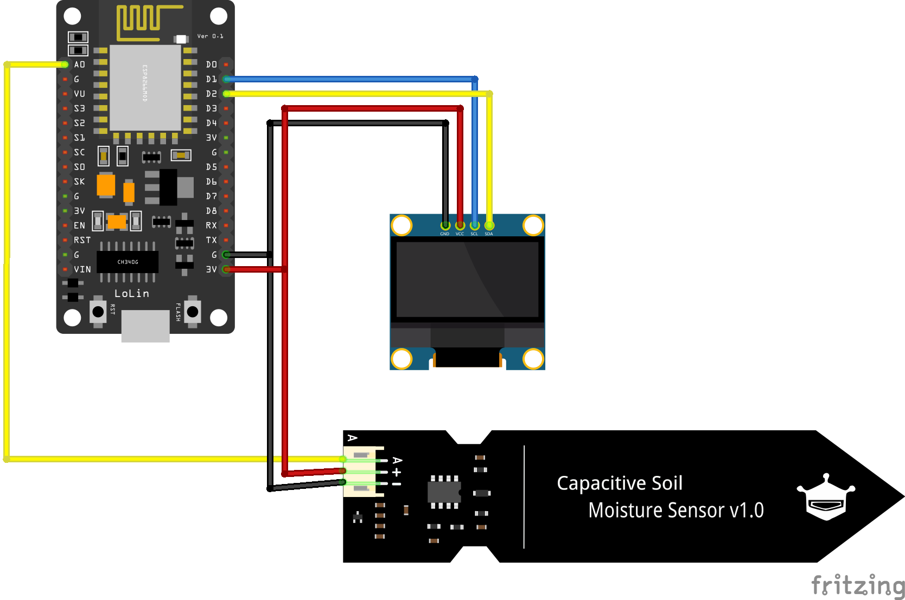

# auto_watering_esp8266

# 硬體清單
|名稱|購買連結|
|----|----|
| NodeMcu ESP 8266 開發板 | https://shopee.tw/product/10708564/2090105177 |
| 土壤濕度感測器模組 | https://shopee.tw/product/20917936/2000383913|
| 0.96吋 OLED 螢幕(白光) | https://shopee.tw/product/27742636/3348208081

<div>&nbsp;</div><div>&nbsp;</div>

# 設定 Arduino IDE 環境
### 添加 ESP 8266 套件
1. 檔案 / 偏好設定 / 額外的開發板管理原網址：
```
http://arduino.esp8266.com/stable/package_esp8266com_index.json
```
2. 工具 / 開發板 / 開發板管理員
    - 搜尋ESP8266
    - 安裝 esp8266 by ESP8266 Community 

3. 工具 / 開發板：選擇開發板 Generic ESP8266 Module
4. 選擇連接 Port
    - Windows 可以透過裝置管理員查詢
    - Mac 可以在 Terminal 輸入下面，來觀察
    ```
     ls /dev/tty.*
    ```

5. 開啟 檔案 / 範例 / ESP8266 / 閃爍(Blink) ，並燒錄上傳，確認是否成功規律閃爍。

<div>&nbsp;</div><div>&nbsp;</div>

### 添加 U8g2 螢幕繪圖程式庫
1. 草稿 / 匯入程式庫 / 管理程式庫
1. 搜尋 U8g2 並安裝 U8g2 by oliver
1. 測試：檔案 / 範例 / U8g2 / full_buffer / HelloWorld 


[U8g2字型列表](https://github.com/olikraus/u8g2/wiki/fntlistall)

<div>&nbsp;</div><div>&nbsp;</div>

# 線路圖
